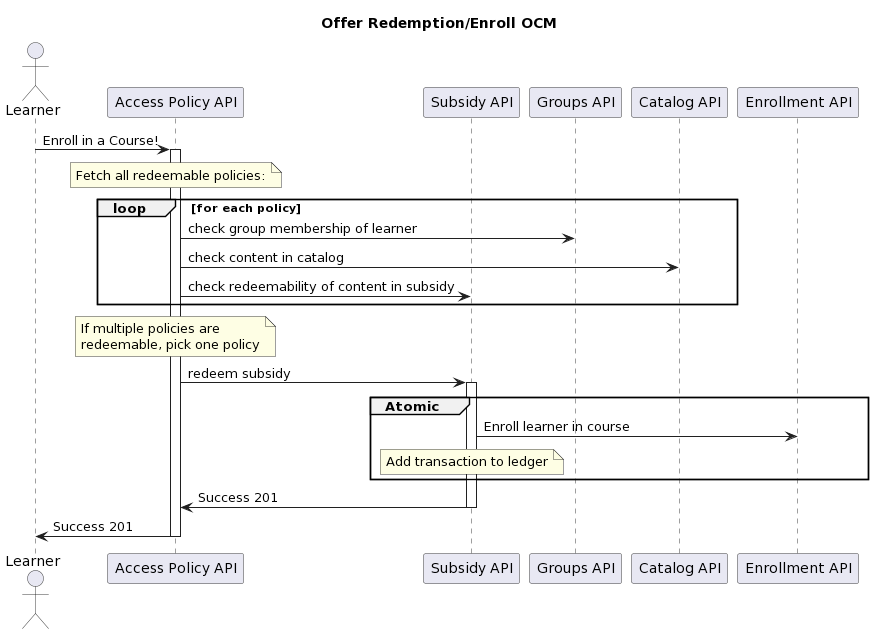

3. Add Access Policy functionality
##################################

Status
======

Draft Feburary 2023
-------------------

Context
=======

The enterprise teams are currently undertaking a project to allow the purchase and enrollment from product lines that
beyond edX open courses. The purchasing of these courses is being accomplished via new "offers" functionality that will
allow learners to get the course content they are seeing regardless of what product line these courses are currently.

We have identified a need to restrict purchases in some ways. Some examples:
* Enterprise Learners should only be allowed to redeem a course should their offer have enough money
* Enterprise Learners should only be able to spend X dollars on a particular course type
* Enterprise Learners should only be able to enroll in courses that are in a catalog assigned to them

We currently do not have a system that will allow us to represent and enforce these rules.

Decision
========

We will build backend that is primarily responsible for key business rules about access to Subsidy value and decisions
about the redemption of value stored in those subsidies.

We propose a component . This IDA should include:
* Models that persist data
* A Python API that defines business logic, through which consumers interact with the models.
* A REST API defining views that interact with the Python API (aka a “web service”)
* A producer/emitter of asynchronous events sent to some message broker.

This backend component should be a Django app contained within the enterprise*access IDA.

The API should provide 2 primary methods of query against the rules engine:
* “can redeem”: The learner is part of a group in an access policy, which is associated with a subsidy that stores value
in the form of licenses or learner credit. Any learner in that group is entitled to that stored value - they can redeem
it through that subsidy.

* "redemption": The learner is part of a group in an access policy, which is associated with a subsidy and catalog, where
that group is entitled to the value stored in the subsidy. Any learner in that group may redeem that stored value for
content included in that catalog.  When a redemption occurs, it ultimately results in the subsidy service writing a
transaction record associated with the redemption.

The proposed design supports a few characteristics:
* Encapsulation: Business decisions and rules are encapsulated by concrete model instances.
* Loose Coupling: It separates these decisions and rules from the context of Subsidies.
* Modularity: Different customer use-cases about entitlement and redemption can be modeled as new types (sub-classes)
of the Subsidy Access Policy model.

Example Redemption Flow
-----------------------

Consequences
============

* By adopting this ADR we commit to building all new and future policies to access courses in to this rules engine.
* This system by it's very nature will need to integrate with a lot of different systems across the platform

Rejected Alternatives
=====================

We rejected continuing to use the existing offers system as implemented by edx-ecommerce as it is in the process of
being deprecated.

References
==========

`Access Policy Commission`_
`Prototype`_

.. _Access Policy Commission: https://2u-internal.atlassian.net/wiki/spaces/SOL/pages/229212214/Commission+Subsidy+Access+Policy+API
.. _Prototype: https://github.com/openedx/enterprise-access/pull/83