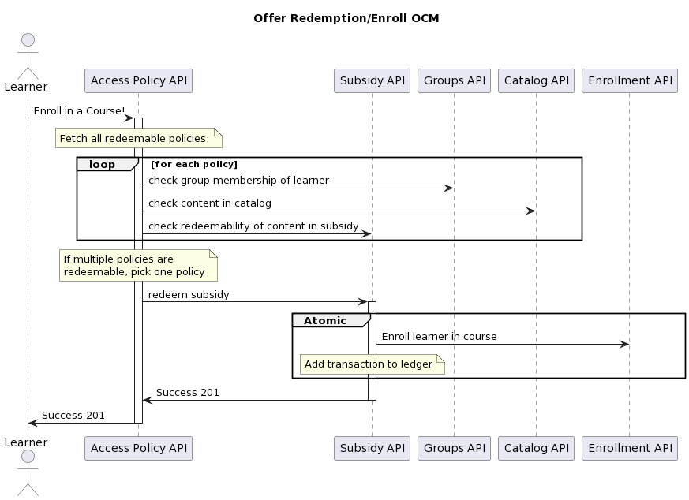

4. Add Access Policy functionality
##################################

Status
******

**Accepted**

Feburary 2023

Context
*******

We've introduced a new Django service, ``enterprise-subsidy``, to provide a new implementation of Learner Credit,
in which learners in an enterprise can redeem the balance of their enterprise's Learner Credit ledger to pay
for verified enrollments in any kind of content supported via Enterprise Catalogs.
Some time in the future, we plan to implement subscription license redemption via the enterprise-subsidy service, too.
More generically, we like to think of subsidies as containing value that can be redeemed - that value
may be in the form of dollars, enrollment "seats", subscription licenses, or anything else we think of in the future.
See the `Enterprise Subsidy Initial ADR`_ for more context.

The business decisions around which learners are allowed to redeem value for content can be varied and
sometimes complex, depending on the nature of our contract with an enterprise, for example:

- Enterprise Learners should only be able to spend 500 dollars on a particular type of content during the life of their subsidy.
- Enterprise Learners should only be able to enroll in courses that are in a catalog associated with an enterprise.
- Enterprise Learners should only be able to enroll in 3 courses, maximum, during the lifetime of their subsidy.

We currently do not have an application that allows us to represent and enforce these rules - they are instead enforced
across frontend and backend code - and therefore cannot ascertain how such rules are applied without examining
multiple codebases. Keep in mind that multiple of these allowable business decisions, or "policies", may be applicable at a given
time for a given enterprise.

In writing an access policy application, we'll be able to command and query who is allowed to redeem
subsidy value, from which allowed set of content, via what access method.  It should also support our
general compliance requirements, protecting our business reputation and general business account veractiy.

Decision
********

We will build a Subsidy Access Policy application to that meets the qualities described above.  It will
be a new Django application in the ``enterprise-access`` service.  It will broadly include:

- Models that persist data
- A Python API that defines business logic, through which consumers interact with the models.
- A REST API defining views that interact with the Python API (aka a “web service”)
- A producer/emitter of asynchronous events sent to some message broker.

The base access policy model should be composed of references to an enterprise subsidy, an enterprise catalog,
an access method (e.g. direct learner enrollment, or Browse & Request), and optionally, the total value allowed
to be redeemed via the policy (that is, the maximum number of dollars or seats allowed to be consumed).  In the future,
we suspect that it will also be composed of a reference to an enterprise group - a component that does not
yet exist in the enterprise system.

Types of policies
=================

Modeling policies via Single Table Inheritance
----------------------------------------------

The base ``SubsidyAccessPolicy``  model defines the most core business logic (i.e. method implementations)
for all types of access policies.  It implements ``can_redeem()``, ``redeem()``, and ``has_redeemed()`` methods,
which take into account the inclusion of some content key in the policy’s catalog; whether there is
an active subsidy with enough remaining value; and whether the given user belongs to the policy’s group
(for early iterations, this really just means “is the user an enterprise learner in this customer?”)
These three method are the core interface of the Subsidy Access Policy app.
We provide some pseudo/prototype code below to demonstrate the core concerns covered
by the business logic of these three methods.  Each one likely takes a content key and learner identifier as parameters.

can redeem
----------
Given a content key and learner identifier, answers whether the learner is allowed to redeem via this policy.

.. code-block:: python

   if not self.catalog_client.catalog_contains_content(self.catalog_uuid, content_key):
     return False
   if not self.group_client.group_contains_learner(self.group_uuid, learner_id):
     return False
   if not self.subsidy_client.can_redeem(learner_id, content_key):
     return False
   return True
   
redeem
------
Given a content key and learner identifier,
this method calls on the Subsidy service to begin redemption of value for access to the content.

.. code-block:: python

   if self.can_redeem(learner_id, content_key):
     if self.access_method == AccessMethods.DIRECT:
        return self.subsidy_client.redeem(learner_id, content_key)
     if self.access_method == AccessMethods.REQUEST:
        return self.subsidy_client..request_redemption(learner_id, content_key)
   return None

get redemptions
---------------
Given a content key and learner identifier,
answers what redemption records, if any, exist for the learner and content via this policy.

.. code-block:: python

   if self.access_method == AccessMethods.DIRECT:
     return self.subsidy.has_redeemed(learner_id, content_key)  # pylint: disable=no-member
   elif self.access_method == AccessMethods.REQUEST:
     return self.subsidy.has_requested(learner_id, content_key)
   else:
     raise ValueError(f"unknown access method {self.access_method}")

Use custom single-table inheritance pattern
-------------------------------------------

Our most common query patterns will require that we find all applicable policies for a given enterprise - there
might be several at a given time. As described in the **Rejected Alternatives** section below, the base Django
patterns for abstract or multi-table inheritance have some drawbacks for this query pattern that would ultimately
require us to perform multiple database selects to get the policy records we want
*that are wrapped by the Django model child class we want*.  Luckily, Django provides one of the key building blocks
of `single-table inheritance`_ in the form of `proxy models`_.  Single-table inheritance is a means by which a field
in the database table identifies which class (Django model) in the object hierarchy the record belongs to - all the fields
of all the classes in the heirarchy are stored in the same table, hence "single table" inheritance.  A good
`roadmap for single-table inheritance in Django`_ exists and will be the basis of our custom implementation of this pattern.

Our custom implementation of this pattern consists of:

- Concrete parent model with all fields, including all the fields for all of the children
- A type/Discriminator field of some kind will also be required on this model.
- The child policy models (as described in **Context** above) become proxy model sub-classes
  to encapsulate their specific business logic.
- A parent class query manager (eg ``PolicyManager``) which queries the main table and
  "type-casts" the individual response records into the correct Proxy Model instance. This allows us to
  query one table to find all policies for a given customer, catalog, etc. It also lets us query one table
  for a specific policy record, by the UUID primary key.
- The Django ORM requires us to add a small wrapper that takes the ORM results,
  which will be ``SubsidyAccessPolicy`` records (i.e. the base model), and return instead a new collection
  with each item properly typed as the appropriate child/proxy model.

As a consequence, this avoids the need to write complex branching logic and querysets to cover multiple
policy subtypes from a single method implemention. Instead, we might do things like:

- ``SubsidyAccessPolicy.get_policies_for_enterprise(enterprise_uuid)`` -> ``list(AKindOfPolicy, BKindOfPolicy, AKindOfPolicy)``
- ``SubsidyAccessPolicy.get_policy(policy_uuid_a)`` -> ``AKindOfPolicy(...)``
  and ``SubsidyAccessPolicy.get_policy(policy_uuid_b)`` -> ``BKindOfPolicy(...)``

One drawback that the first example demonstrates is that there might be method implementations
that return lists of model instances instead of querysets; querysets are generally
more composable within the Django framework.

Use a version field
-------------------
We should introduce ``version`` as a field of ``SubsidyAccessPolicy``, so we know what state of a policy
allowed a particular transaction to be fulfilled.  This requires including a reference to the
versioned policy in the subsidy transaction metadata.
One suggestion is to rely on the historical id of the policy (from Django simple-history)
to provide this reference on the subsidy transaction record.

Thinking about configurations of policy types
---------------------------------------------
There's a "base" configuration for any type of policy:

- the base subsidy uuid - either subscription plan uuid (from license-manager)
  or a LearnerCreditSubsidy.uuid that reference a subsidy defined in the new enterprise-subsidy service.
- the catalog identifier associated with that plan (from enterprise-catalog)
- the enterprise uuid
- the access method (e.g. Browse and Request or Direct Enrollment)

You can think of each row of the table below as a Django ``models.Model`` class.

.. list-table:: Policy Types
   :widths: 30 30 30
   :header-rows: 1

   * - policy type
     - configuration
     - business logic
   * - subscription-access-policy
     - (base)
     - (base)
   * - learner-credit-access-policy
     - (base)
     - (base)
   * - per-learner-enrollment-cap-learner-credit-access-policy
     - Max enrollments allowed for any learner (in the policy group/enterprise) via this policy.
     - (base) + check that existing fulfilled subsidy transaction count <= the max allowed for any learner.
   * - per-learner-spend-cap-learner-credit-access-policy
     - Maximum spend (in dollars) allowed for any learner (in the group/enterprise) via this policy
     - (base) + check that existing fulfilled subsidy transaction sum <= the max spend allowed for any learner
   * - capped-enrollment-learner-credit-access-policy. e.g. There’s a single subsidy with a starting balance of $100k, but the customer wants spend originating from this policy to be capped at $25k, because the catalog for this policy is the more expensive Exec Ed content.
     - There is a maximum amount that can be spent aggregated across all users covered by this policy.  It’s a number that’s less than that starting balance of the subsidy.
     - (base) + check that total spend via this policy is less than the maximum spend already fulfilled via this policy.

We can easily imagine a future where 2 or more of the above rows have business logic composed
into a single policy, example: a policy that allows up to two enrollments per learner and
allows no more than $10k of total spend via the policy (against a Subsidy that might have a starting balance of say $30k).
Note that policies that examine the count or sum of existing transactions
should rely on the Subsidy to tell the Policy about those transactions.
**Policies should not keep their own tally of enrollments or spend.**

.. list-table:: What policy records look like in a DB table
   :widths: 30 30 30 30 30 30 30 30
   :header-rows: 1

   * - enterprise slug (really uuid)
     - policy type
     - version
     - catalog title (really a slug)
     - subsidy uuid
     - access method
     - group id
     - is_active
   * - acme-co
     - learner-credit-access-policy
     - 1
     - the-exec-ed-catalog
     - acme-co-bucket-of-money
     - direct-enrollment
     - the-whole-enterprise
     - yes
   * - alphabet-soup-co
     - capped-enrollment-learner-credit-access-policy
     - 1
     - the-open-courses-catalog
     - alphabet-soup-bucket
     - direct-enrollment
     - the-whole-enterprise
     - yes
   * - acme-co
     - subscription-access-policy
     - 2
     - the-open-courses-catalog
     - acme-co-subscription-plan-alpha
     - browse-and-request (to get a license assigned)
     - the-whole-enterprise
     - yes

Policy Resolution
=================
Higher level than the policies themselves is the subsidy-access-policy API endpoint
which is ultimately tasked with accepting a ``user_id + content_key`` as input and trying to
turn that into a redemption/transaction.  As part of this work, we will need to find a redeemable policy,
but there may be cases where, for a given user_id and course_key, multiple policies are valid candidates.
However, it doesn’t necessarily make sense to redeem multiple subsidies,
so the the policy resolver is the component that narrows down the remaining options to just one redeemable policy.

We’ve discussed a simple approach for MVP to select a single policy by prioritizing ``LearnerCredit`` types of policies,
then after that prioritizing subsidies with smaller balances.  Here’s a prototype, at least for an early implementation:

::

   resolve_policy(redeemable_policies):
     """
     Select one out of multiple policies which have already been deemed redeemable. 

     Prefer learner credit policies, and prefer smaller balances.

     Deficiencies:
       - if multiple policies with matching subsidies tie for first place, the
         result is non-deterministic.
       - if multiple policies with identical balances tie for first place, the
         result is non-deterministic.
     """
     sorted_policies = sorted(
         redeemable_policies,
         # p.policy_type_priority is a class property that's a lower number for
         # LearnerCreditSubsidyAccessPolicy and higher for SubscriptionSubsidyAccessPolicy.
         key=lambda p: (p.policy_type_priority, p.subsidy.balance),
     )
     # Simply pick the first policy:
     return sorted_policies[0]

Concurrency and Transaction Isolation
=====================================
The following measures are proposed to ensure transaction isolation for a given redemption:
Access policy level lock: Applied at the entire policy level, this lock ensures that no other redemption
against a policy can execute concurrently and exceed the per-policy limits on enrollment or spend.
Learner specific lock: Applied on a combined instance of a learner and policy, this lock ensures that no other
redemption against the same learner can execute concurrently and exceed the per learner limits on enrollment or spend.
Incase of a policy with more than one limit e.g. both at the policy and learner levels, the more restrictive
policy level lock can be used.
As a start, policy level locks will be implemented with active monitoring of http 423 status codes to see
if the learner level locks are warranted.

.. code-block:: python

  try:
    lock_acquired = acquire_subsidy_policy_lock(
      policy.uuid,
      django_cache_timeout=SUBSIDY_POLICY_LOCK_TIMEOUT_SECONDS,
    )
    if not lock_acquired:
      return Response(
          data='Enrollment currently locked for this subsidy.',
          status=status.HTTP_423_LOCKED,
      )
    if policy.can_redeem(learner_id, content_key):
      response = policy.redeem(learner_id, content_key)

    return Response(
      response,
      status=status.HTTP_200_OK,
    )
  finally:
    if lock_acquired:
      release_subsidy_policy_lock(policy.uuid)

Benefits of the overall design
==============================
The proposed design supports a few characteristics:

- Encapsulation: Business decisions and rules are encapsulated by concrete model instances.
- Loose Coupling: It separates these decisions and rules from the context of Subsidies.
- Modularity: Different customer use-cases about entitlement and redemption can be modeled as new types (sub-classes)
  of the Subsidy Access Policy model.

Example Redemption Flow
=======================

Consequences
************

- Custom single-table inheritance introduces some non-standard Django model code which generally increases complexity.
- By adopting this ADR we commit to building all new and future policies to access courses via the business rules
  encapsulated by subsidy access policy records.
- This system by it's very nature will need to integrate with a lot of different systems across the platform
- We need to pick a strategy for achieving atomicity of policy-based redemptions that put a limit
  on the amount of spend per learner or per policy; this will be captured in a forthcoming ADR.

Rejected Alternatives
*********************

- We rejected continuing to use the existing offers system as implemented by edx-ecommerce as it is in the process of
  being deprecated.
- We considered using `Abstract base class inheritance`_ to encapsulate different policy types
  as Django models.  We rejected this approach because of the implied complexity of supporting our most common query patterns - most of our queries
  would have to consist of multiple SQL selects to understand *all* of the applicable policies
  for a given enterprise customer.
- We also considered using `Multi-table inheritance`_ to model policies. We rejected this for several reasons.
  First, because of the implied complexity of downstream reporting query patterns - this approach would have
  required aggregating all policy child tables to build a complete picture of the policy state for a given
  enterprise customer.  Second, this would not have given us the nice "type-casting" behavior that our
  custom single-table inheritance solution offers - we'd have to fight against the innate mechanics of Django
  Multi-table inheritance to query e.g. ``SubsidyAccessPolicy`` and get a ``PerLearnerCapPolicy`` in return.

.. _Enterprise Subsidy Initial ADR: https://github.com/openedx/enterprise-subsidy/blob/main/docs/decisions/0001-purpose-of-this-repo.rst
.. _Multi-table inheritance: https://docs.djangoproject.com/en/3.2/topics/db/models/#multi-table-inheritance
.. _Abstract base class inheritance: https://docs.djangoproject.com/en/3.2/topics/db/models/#abstract-base-classes
.. _single-table inheritance: https://en.wikipedia.org/wiki/Single_Table_Inheritance
.. _proxy models: https://docs.djangoproject.com/en/3.2/topics/db/models/#proxy-models
.. _roadmap for single-table inheritance in Django: https://stackoverflow.com/questions/241250/single-table-inheritance-in-django/60894618#60894618
