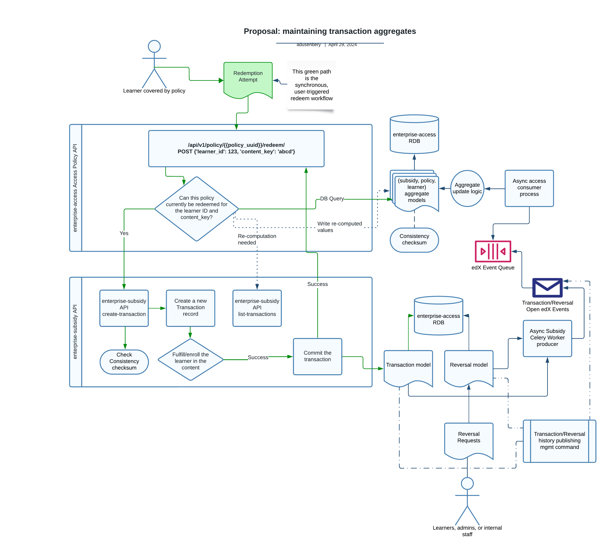

0021 Persisted Policy-transaction Aggregates
********************************************

Status
======
**Proposed** (April 2024)

Context
=======
Part of the primary responsibility of the ``subsidy_access_policy`` module is to
act as a "read-orchtestrator" for redeemability, determining which learner-credit-based redemptions
are allowed under various conditions. The business logic to determine this depends on
data persisted elsewhere in our distributed system - importantly, it relies on the
enterprise-subsidy to compute aggregate transaction quantity sums (or "spend") at various levels:
for the entire subsidy/ledger record, for the policy (or "budget"), and for the learner within
a given policy. There are also forthcoming circumstances where the enterprise-access service
would like to know the aggregate *count* of learner transactions for a given policy-group identifier.

This distributed dependency design was chosen because it helps decouple services/responsibilities
from a a deployment standpoint, and it helps isolate/secure the transaction-level data in the
enterprise-subsidy service. However, this design has several tradeoffs:

1. Tight "runtime" dependencies exist - the ``can_redeem`` business logic and the redemption
   workflow cannot execute at all without both the enterprise-access and enterprise-subsidy services
   running. Furthermore, that data in each service is highly coupled - policy records in enterprise-access
   *must*  relate to a well-formed and active *subsidy* record in the enterprise-subsidy service in
   order for the redemption workflow to execute.
2. These runtime dependencies utilize synchronous HTTP requests for both the ``can_redeem`` and
   ``redeem`` workflows. This makes the system as a whole less scalable, less elastic,
   and less performant, because each of these workflows must synchronously block on requests from
   enterprise-access to enterprise-subsidy.
   

Decision
========
Build and maintain *aggregate* redemption models in the enterprise-access service. The aggregated
metrics we're most interested in right now are total spend (the sum of transaction quantities) and the count
of transactions.
The aggregated *dimensions* we're most interested in right now are as follows:

1. count/spend metrics at the **subsidy** level - based on ``subsidy_uuid``
2. count/spend metrics at the **policy** level - based on ``subsidy_access_policy_uuid``
3. count/spend metrics at the **(policy, learner)** level - based on (policy id, learner id)

Additionally, we may eventually want aggregates at the **(policy, learner, group)** level, to support
business record configurations where multiple groups relate to a single policy.

Once these aggregates are in place, replace requests to the enterpirse-subsidy service
in the ``can_redeem`` and ``redeem`` flows with database queries against these aggregates.

Maintaining these aggregates depends on sourcing transaction and reversal data as follows:

1. Starting from a zero-state in which Aggregate models exist but are not yet populated (backpopulation).
2. When transactions are committed, any related aggregate records should be updated to reflect it.
3. When reversals are committed, any related aggregate records should be updated to reflect it.
4. Error-correction: we may need to recalculate a given aggregate record when it is found to
   be out-of-sync with the subsidy-ledger source of truth.

Inter-service Communication
---------------------------
There are several options for how transaction/reversal data can make its way to the aggregates
layer in the enterprise-access service:

1. Via management commands that reads transaction and reversal records via the enterprise-subsidy
   REST API.  This approach may work for backpopulation, but is generally disfavorable because
   it won't help us keep the aggregate records up-to-date in a timely manner (we'd have to run
   it on some cron/schedule).
2. Updating the aggregates based on the ``redeem`` response body (on successful redemption).
   This can help us update aggregates as redemptions occur, but won't help us backpopulate
   aggregates.  Furthermore, it doesn't help us update aggregates based on any reversal records
   that are committed.
3. Emiting transaction/reversal commit events from the enterprise-subsidy service. If we can
   emit these to an event broker, consumable by enterprise-access, then we can update aggregates
   as transactions and reversals are committed. Furthermore, we could utilize a Django management
   command to emit events that already exist (perhaps with ``modified`` times
   earlier than some adjustable value) as a way to replay history. This would allow us to backpopulate
   aggregate records.

We'll utilize option (3) to both backpopulate and update aggregate records in real time.

Ensuring Data Consistency
-------------------------
Timely data consistency is one of the main benefits of our ``can_redeem`` and ``redeem`` flows.
The communication along both flows is:

* **synchronous** - it occurs via blocking requests that are initiated from a single service (enterprise-access)
* **transactional** - no transactions are committed without a valid enrollment/fulfillment
  action taking place, so from a business workload perspective, a single flow execution is transactional.
  Note that this does not imply that any given *request* is transactional in the ACID sense.
* **eventually consistent** - in the ``redeem`` workflow, enrollment records can be written to some state
  in our most downstream services, and as soon a response is available to the subsidy service, a
  existing *created* transaction record will transition its state to *committed*. So this flow is technically
  eventually consistent, but the consistency is generally very timely (e.g. the time it takes for an
  enrollment request from enterprise-subsidy -> enrollment services to resolve into a successful response).
  So the synchronous nature of the flow helps lead to timely consistency, even if it is technically
  "eventual".

If we replace the synchronous querying of the enterprise-subsidy service for aggregates, with
database reads of aggregate tables populated by asynchronous events, we've introduced asynchronicity
into our overall flow.  This introduces the risk of running ``can_redeem`` flows with transaction
aggregates that are stale, i.e. individual transaction records exist that have not been
taken into accounts in the aggregate records. Without mitigation, this risks that our overall
``redeem`` flow becomes less consistent, and timely consistency is one of the key cross-functional
requirements of learner credit redemption.

One possible mitigation is to record the timestamp of the most recent transaction or reversal
alongside the corresponding aggregates in the enterprise-access service, which we could introduce
as a kind of "checksum" to the ``redeem`` flow. This flow could be modified to send the checksum
in the redeem request of *enterprise-subsidy*, which itself could query the most recent modified timestamp
of a transaction/reversal related to the request, and reject the request in case the value does not
match that provided in the request. Rejected requests could cause the deletion and re-computation
of the related aggregate records (preferrably via an async celery task).

Another (possibly additional) mitigation is to introduce an aggregate consistencty-checker process
that runs on some schedule.  Such a process could, for each aggregate, re-compute against the
source of truth subsidy ledger, and in the case of discrepancy, update the aggregate value and
log an error message.  This additional workload requires that we maintain it, and it adds
a moderately-small amount of read-load on the enterprise-subsidy REST API. However, it does not
introduce any more synchronous coupling to our redemption workflows, and helps add a level of
proactivity in finding data inconsistencies.

Zero-value vs. uncomputed aggregates
------------------------------------
Disambiguating `implied` aggregates with a value of zero, from cases where an aggregate
`has not yet been computed`, is another scenario that must be addressed. If in a given
``redeem`` workflow we query for aggregates on a given ``(policy, learner)`` pair, and no
aggregate record exists corresponding to that pair in the enterprise-access DB, do we take
that to mean that the aggregate value is zero, or than an aggregate has not yet been computed
for this pair?

One possible mitigation to this last scenario is to hook into the ``can-redeem`` flow
(which is a sub-flow of the ``redeem`` workflow) to help set explicit zero aggregates:
if in the course of the ``can-redeem`` workflow, we encounter an aggregate key for which
no record exists, we could explicitly (and asynchronously) insert an aggregate record
based on the aggregated ledger-transaction response from the enterprise-subsidy service.
The ``SubsidyAccessPolicy`` `methods <https://github.com/openedx/enterprise-access/blob/08f11b02477c88d1d57611ffab1413a21e53e7d9/enterprise_access/apps/subsidy_access_policy/models.py#L521-L568>`_
``aggregates_for_policy()`` and ``transactions_for_learner()``
are good candidates for such an integration point.

Picture of the overall architecture
-----------------------------------
|arch_diagram|

Consequences
============
Utilizing the strategy defined about helps us de-couple runtime dependencies in the ``can_redeem``
and ``redeem`` flows. It also provides opportunities to do such de-coupling in the groups domain,
or in any other domain in the future that depends on these aggregates.
The benefits of this de-coupling are that these flows are more scalable and sufficiently
consistent. It helps increase maintainability from an observability perspective,
and in the sense of easier future feature development around this aggregated data.

However, this strategy introduces complexity, in the emission of events, updating aggreages, and
the consistency "checksum" mitigation described above. If implemented improperly, it introduces
risk of data inconsistency. We believe the benefits outweigh the risks.

Alternatives Considered
=======================
* Introduce a single endpoint in enterprise-subsidy to provide all needed aggregates in a single request.
  This would help reduce overall latency, but provides none of the benefits of de-coupling.
* Async HTTP requests from enterprise-access -> enterprise-subsidy.  This again can help
  overall latency, but gives us none of the other benefits.

