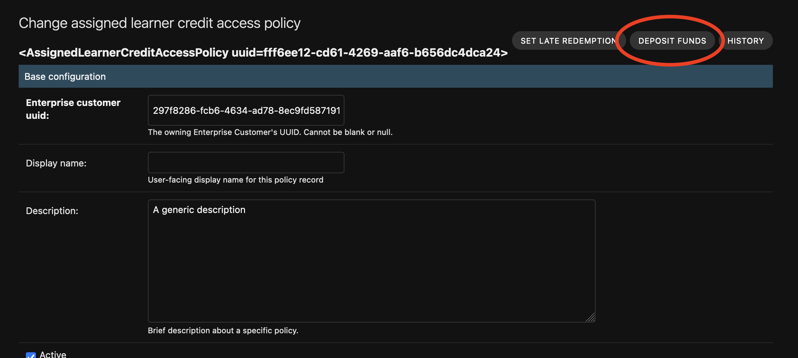
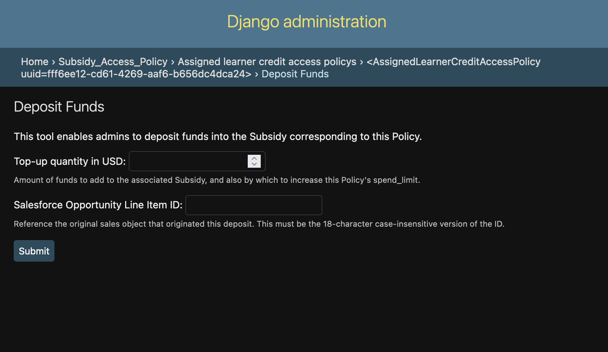

0022 Deposit Creation UX
************************

Status
======
**Adopted** (Jul 2024)

Context
=======

Support for "topping up" leaner credit plans (a.k.a. adding value to a Subsidy) has been added to
openedx-ledger and enterprise-subsidy via Deposit and related models via these PRs:

1. `feat: Deposit model and supporting functionality <https://github.com/openedx/openedx-ledger/pull/91>`_
2. `feat: Ledger creation is now capable of initial Deposit creation <https://github.com/openedx/openedx-ledger/pull/96>`_
3. `fix: deposit sales references should be optional <https://github.com/openedx/openedx-ledger/pull/97>`_
4. `feat: Add data migration to backfill legacy initial deposits <https://github.com/openedx/enterprise-subsidy/pull/269>`_
5. `fix: make initial deposit backfill defensive against subsidy-less ledgers <https://github.com/openedx/enterprise-subsidy/pull/271>`_
6. `fix: make deposit backfill migration defensive against bogus subsidy reference type <https://github.com/openedx/enterprise-subsidy/pull/272>`_

However, the UX for creating a deposit and making the additional value available to learners involves multiple
potentially error-prone steps across multiple services:

1. [enterprise-access django admin] Lookup the Subsidy UUID for the policy to which you want to add redeemable value.
2. [enterprise-subsidy django admin] Lookup the Ledger UUID for the Subsidy.
3. [enterprise-subsidy django admin] Create a Deposit against that Ledger.
4. [enterprise-access django admin] Increase the spend_limit for the Policy.

Decision
========

Create a new Django Admin Action for the SubsidyAccessPolicy edit page called "Deposit Funds" perform all 4 steps
automatically. In order to support this from enterprise-access, we'd also need to expose a Deposit creation API endpoint
from enterprise-subsidy.

In terms of the form fields, we will request only the smallest possible subset of information to avoid errors:

- The deposit amount (in USD)
- The Salesforce Opportunity Line Item ID

Note that until now, the enterprise-access codebase was not aware of any types of sales CRMs. This decision will result
in needing to hard-code a selection of the specific type of sales contract reference provider (the Salesforce
Opportunity Line Item ID).

Demonstration UX
----------------

Here's what the action button on the Policy edit page may look like:

|deposit_action_button|

And here's what the action form may look like:

|deposit_action_form|

Consequences
============

The enterprise-access codebase will become more coupled to enterprise-subsidy/openedx-ledger models, especially
pertaining to the sales contract reference provider slug & name. If we ever change the default sales contract identifier
in the enterprise-subsidy codebase, we'd need to remember update the provider slug & name in enterprise-access code to
match.

This consequence can be somewhat mitigated by consolidating all cross-service couplings into django settings, for
example (enterprise_access/settings/base.py)::

  SALES_CONTRACT_REFERENCE_PROVIDER_NAME = 'Salesforce OpportunityLineItem'
  SALES_CONTRACT_REFERENCE_PROVIDER_SLUG = 'salesforce_opportunity_line_item'

These values can then be referenced in custom admin forms and underlying view logic.

Alternatives Considered
=======================

We could instead have added deposit creation support to the existing "learner credit provisioning tool" feature in
support-tools. However, at the time of writing, further investment into the provisioning tool has been halted.

We could have added a brand new tool to support-tools under the Learner Credit section, which arguably would be more
intuitive and closer to where ECS support staff typically spend time, but that would have required a larger investment,
as django admin actions provide a significant portion of the feature out-of-the-box.

