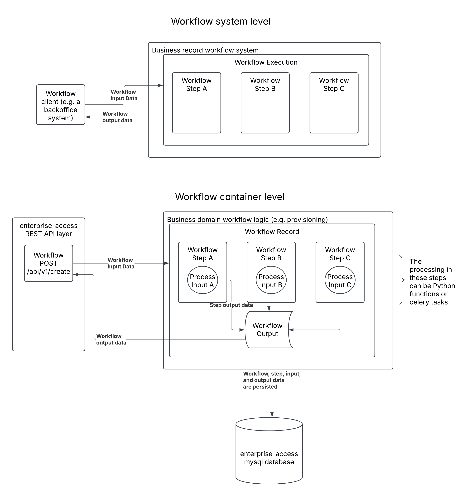
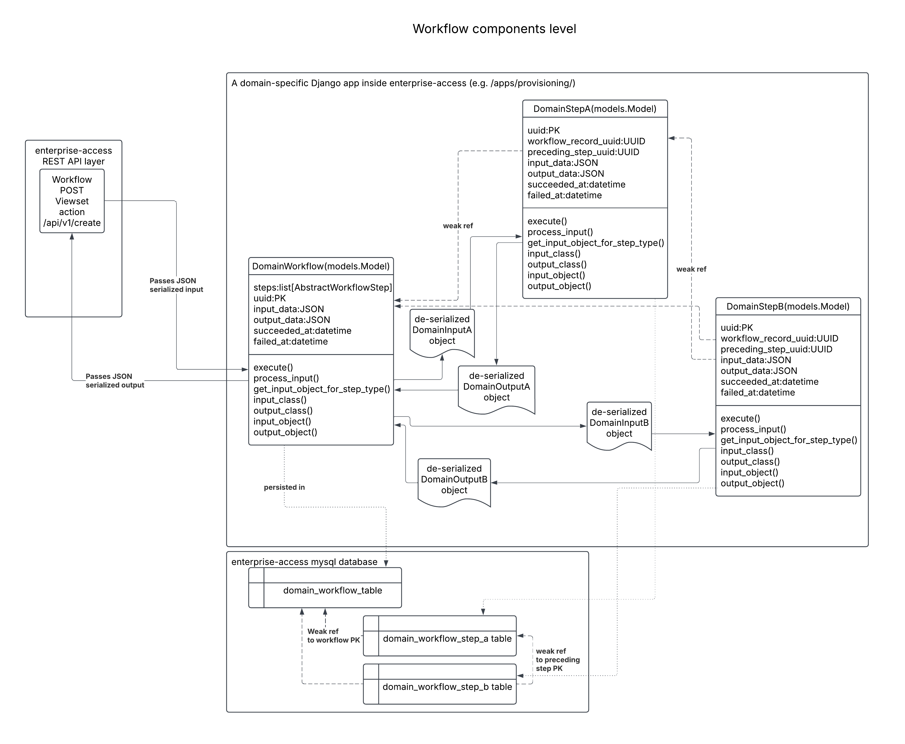

0025 Adding an abstract workflow pattern
****************************************

Status
======
**In progress** (March 2025)

Context
=======
We have decided to add a workflow pattern and related Django app (and abstract models)
to our codebase. This will allow us to manage and persist workflow state in an
auditable and customizable manner.
The first concrete implementation of workflows we plan to represent
is a provisioning workflow (see prior ADR for the HTTP API portion of this workflow) -
a flow that allows clients to provision new Enterprise Customer, Catalog,
and Subsidy records programmatically via a single API endpoint
(or other types of single entrypoint interfaces). Notably, we’d like to provide
an abstract implementation of workflows to support similar future concrete
implementations - e.g. automated *onboarding* of customers.

Decision
========
We decided to add a workflow pattern and related abstract Django models to our codebase because:
It will provide a consistent means to model and manage workflow-based business operations across our codebase.
Workflows are a fundamental and relatively straightforward “system primitive”.
The workflow pattern is composable, modular, and supports
introspection/auditing of the executions of our core business processes.

From a systems-level and container-level perspective (in the C4 diagramming parlance), here's
what a concrete workflow implementation will look like:

|workflow_system_container_diagrams|

And zooming-in to the level of model fields and methods:

|workflow_component_diagram|

Alternatives Considered
=======================
* Using a third-party workflow library. We considered both https://joeflow.readthedocs.io/en/latest/index.html
  and https://docs.viewflow.io/overview/index.html. The former was too simple
  for our needs and didn’t come with a way to persist workflow/step records out of the box.
  The latter was much more than we needed,
  and was modeled in a way that was more complex than we liked.
* Celery-as-workflow. Celery is also composable, modular, auditable, and so forth. Additionally,
  we already use celery in our system. We chose not to implement a workflow pattern purely in celery
  mainly so that we can keep our workflow pattern as simple as possible at this time - this will
  make it easier to achieve introspection, particularly via Django Admin. Choosing celery as our
  workflow implementation would still require that we wrap a model around the execution of celery tasks
  and chords to achieve Django Admin-based introspection. We do envision a near-term future in which asynchronous
  workflow executions are supported via celery - the simplest version of this would be to wrap a workflow's
  execution inside a single celery task.
* Not adding a workflow pattern to our codebase (i.e. maintain current state and use a purely
  HTTP-based API to support the example provisioning flow). This would be the simplest solution,
  but it would also limit our ability to create workflows that are composable,
  auditable, re-runnable, and modular. It also would not give us a
  common abstraction to build future concrete solutions to encapsulate core business processes. Utilizing
  a workflow pattern helps simplify how external systems (e.g. backoffice systems) may communicate
  with the edX system, by doing less orchestration at the edge.

Consequences
============
* We will need to spend time developing and testing this pattern.
* We'll need to communicate and provide training around this pattern.
* We will need to update our documentation to reflect the workflow pattern.

