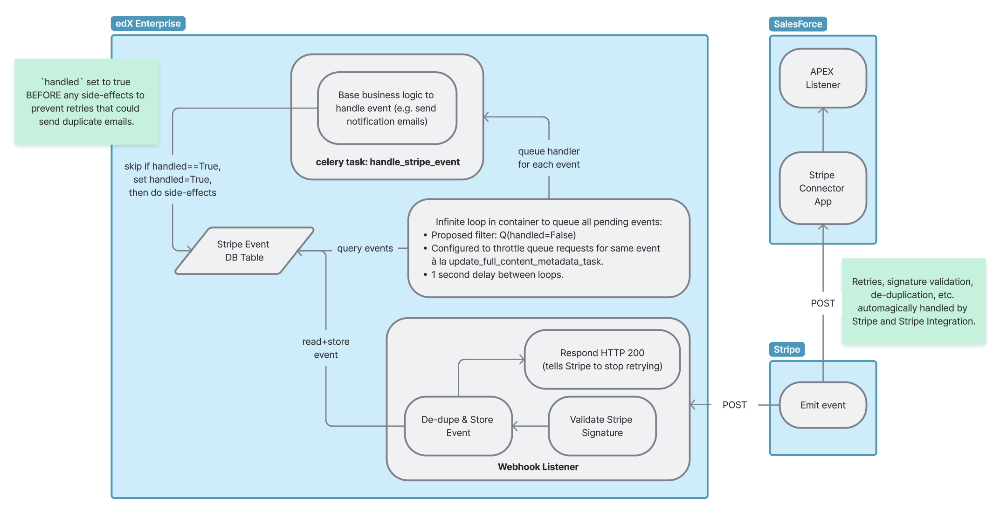

0025 Stripe Event Consumption And Delivery
******************************************

Status
======
**In progress** (March 2025)

Context
=======

We intend to utilize Stripe to manage subscription and payment lifecycles for the Enterprise Self-Service Purchasing
feature. We will need a robust way to ingest events from Stripe, handle those events, and forward them to SalesForce.
For example, when stripe emits an ``invoice.paid`` event, that needs to be communicated to SalesForce in order to
trigger the creation/update of Customers, Opportunities, etc. Furthermore, that same event needs to be communicated to
our edX Enterprise backend so that we can immediately followup with the customer to confirm that we have begun to
provision their product.

At minimum, "robust" means:
- Spoofed events are discarded.
- Network failure does not cause dropped events.
- Network failure does not cause events to be handled multiple times, or duplicate products provisioned.

Decision
========

The selected solution can be described as having three decoupled parts:

#. **Ingest:** Implement a new webhook endpoint in the edX Enterprise backend.

   * IDA and URL: TBD.

   * The view logic should robustly ingest Stripe events, storing them in the DB.

     * Use `signature validation <https://docs.stripe.com/webhooks#verify-official-libraries>`_.

     * Use `de-duplication <https://docs.stripe.com/webhooks#handle-duplicate-events>`_.

   * After successful ingestion, respond with HTTP 200 to tell Stripe to stop retrying sending the event.

#. **Pick:** Implement an asynchronous event picker to continuously try to pick events to handle/forward.

   * Architecturally, this is an infinite loop via management command running in a dedicated container/pod.

     * Alternatively, this might work as a Celery "beat" scheduled for every 10 seconds.  This could reduce
       code/infrastructure requirements.

   * Ingested events which have not been handled will cause ``handle_stripe_event`` tasks to be queued.

   * Ingested events which have not been forwarded will cause ``forward_stripe_event`` tasks to be queued.

   * In order to give celery time to handle the event without sacrificing loop frequency, throttle queue requests for a
     given event ID by checking the TaskResult table just like `how we throttle tasks in enterprise-catalog
     <https://github.com/openedx/enterprise-catalog/blob/01f5367309ee25093e414b0fd3498a48ec575073/enterprise_catalog/apps/api/tasks.py#L134>`_.

   * A suggestion on scheduling order: In case multiple events for the same customer are pending, we should make a best
     effort to chain the task requests for a given customer (Celery tasks can be natively chained). Handling or
     forwarding events out of order for a given customer would probably expose weird corner cases.

#. **Handle:** Implement two celery tasks: one to handle an event and another to forward an event to SalesForce.

   * "Handling" and "forwarding" an event is bifurcated into separate celery tasks in order to have tighter control over
     retry and different sensitivities to duplicate invocations.

     * Handling an event: This is primarily for one-time communications. This should happen only once, and not trigger a retry.

     * Forwarding an event: The receiver should be designed to handle duplicates, so we can eagerly retry.

Alternatives Considered
=======================

Rejected
========

* Queue event handler immediately as part of the ingestion, instead of via an asynchronous picker.

  * This is too sensitive to errors during ingestion, which could result in dropped events.

* Use a k8s ``cronjob`` to schedule the picker component.

  * This was okay, but cronjobs have a minimum frequency of minutely, which could add an uncomfortable amount of delay.

In Consideration
================

* Utilize the `Stripe Connector App
  <https://docs.stripe.com/plugins/stripe-connector-for-salesforce/installation-guide>`_ to directly send stripe events
  to SalesForce.

  * Pros:

    * Don't have to write SalesForce APEX code to validate/de-duplicate events.

    * Less sensitive to downtime in our event pipeline.

  * Cons:

    * More set-up inside the SalesForce WebUI.

    * Slightly worse observability of delivered events (for DD alerting purposes).

    * Costs money?  I'm not sure what's meant by "$1/company/one-time payment".

Consequences
============

TODO
