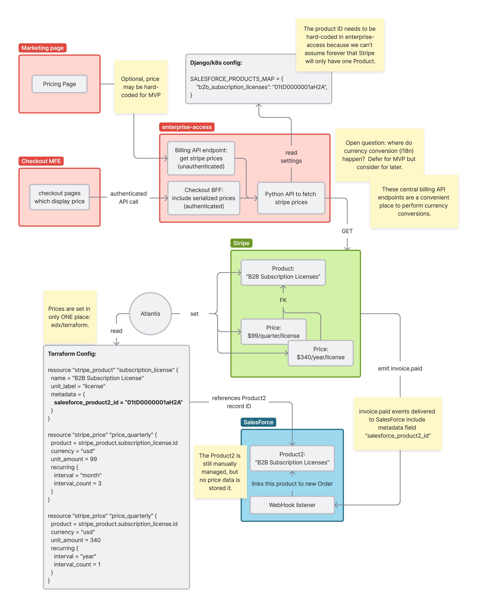

0027 Self-Service Pricing
*************************

Status
======
**In progress** (April 2025)

Context
=======

For self-service purchasing, multiple frontends/backends/services throughout the customer
journey will need to know the price of each self-service offering.  It's no longer
sufficient to store prices in a spreadsheet, as they need to be instantly retrievable.  At
the same time we can't tolerate price discrepancies within the same checkout journey, so
prices need to propagate to every system very quickly.

Decision
========

We will define Stripe products and prices via Terraform.  These prices will be made
available via a central python API method within enterprise-access which
dynamically fetches the prices from Stripe.  This python API in turn will drive
the inclusion of price data within various REST APIs:

* GET https://enterprise-access.edx.org/api/v1/billing/prices

  * Unauthenticated endpoint intended for delivery of pricing to Marketing pages.

* POST https://enterprise-access.edx.org/api/v1/bffs/checkout/checkout

  * Authenticated BFF endpoint for the checkout MFE, which happens to include pricing
    information in the response.

Alternatives Considered
=======================

* 

Consequences
============

Product and price attributes in Stripe can only be modified by engineers familiar with
Terraform and Git. The following attributes would become Terraform/git managed only:

* Product name displayed on invoices and receipts.
* Prices and payment intervals.

I expect these are such slow changing values that enterprise engineering likely can manage
the volume of update requests. If we ever change our mind in the future, we can always set
the ``ignore_changes`` lifecycle key to include ``unit_price`` and just use terraform to
manage everything except the actual price.
