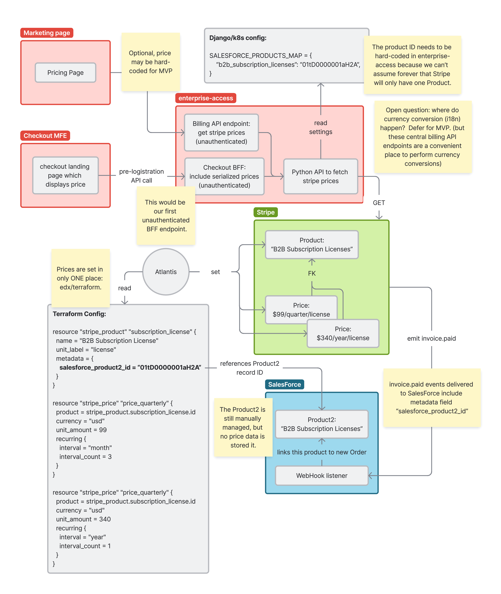

0027 Self-Service Pricing
*************************

Status
======
**In progress** (April 2025)

Context
=======

For self-service purchasing, multiple frontends/backends/services throughout the customer
journey will need to know the price of each self-service offering.  It's no longer
sufficient to store prices in a spreadsheet, as they need to be instantly retrievable.  At
the same time we can't tolerate price discrepancies within the same checkout journey, so
prices need to propagate to every system very quickly.

Decision
========

We will define Stripe products and prices via Terraform.  These prices will be made
available via a central python API method within enterprise-access which
dynamically fetches the prices from Stripe, possibly internationalizes it, then
serializes it in a way that is consumable by frontends.  This python API in
turn will drive the inclusion of price data within various REST APIs:

* GET https://enterprise-access.edx.org/api/v1/billing/prices

  * Unauthenticated endpoint intended for delivery of pricing information to marketing pages.

* GET https://enterprise-access.edx.org/api/v1/bffs/checkout/???

  * Unauthenticated BFF endpoint for the checkout MFE pre-logistration route,
    which happens to include pricing information in the response, alongside
    other information which may be required by this route, such as form
    validation instructions.

* Any additional unauthenticated or authenticated endpoints as needed.
  The same general pattern applies: We should strive to fetch,
  internationalize, and serialize pricing data via a centralized Python API,
  then expose the result whever needed.  This should help to minimize code
  duplication and cache segmentation.

Note that no authenticated endpoint is proposed to include pricing information,
but this is not a rule.

Serialized Price
----------------

For an MVP implementation, we may adopt the following format which is already
in use elsewhere in our platform::

  {"usd": 10.5, "usd_cents": 1050}

This should be straightforward to adapt to include additional currencies based
on their respective three-letter currency codes.

Alternatives Considered
=======================

Store prices in Salesforce
--------------------------

When I looked into PricebookEntry records in the 2U SalesForce, I found prices
manually configured, including enterprise subscription licenses and even
learner credit.  However, I was told that these records are ignored, and do not
drive any business logic.  Instead, prices are actually referenced from other
places, such as spreadsheets.

Zach was open to the idea of using these records with more intentionality, so I
seriously considered building a system to synchronize SalesForce PricebookEntry
records and other related records to equivalent Stripe objects.  However, the
resulting complexity and effort was too great just to treat SalesForce as a
storage location, especially given the fact that there is no plan to leverage
these records in the future.

Consequences
============

Friction when changing price
----------------------------

Product and price attributes in Stripe can only be modified by engineers
familiar with Terraform and Git. I expect these are such slow changing values
that enterprise engineering likely can manage the volume of update requests.

The following attributes would become Terraform/Git managed only:

* Product name displayed on invoices and receipts.
* Prices and payment intervals.

That said, we can always set the ``ignore_changes`` lifecycle key to include
``unit_price`` and just use terraform to manage everything except the actual
price. Other stakeholders outside of engineering with Stripe Web UI access and
sufficient permissions would be able to tweak the prices directly.

Unauthenticated BFF support
---------------------------

The ``BaseBFFViewSet`` currently `requires an authenticated client.
<https://github.com/openedx/enterprise-access/blob/b95728b07c31f34d614828cda578f35cbafb40e2/enterprise_access/apps/api/v1/views/bffs/common.py#L43-L44>`_
A brief audit of the code suggests that only minor modifications to the base
ViewSet could allow us to introduce a new unauthenticated version, perhaps
named ``BaseUnauthenticatedBFFViewSet``.
