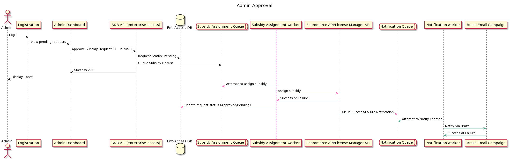
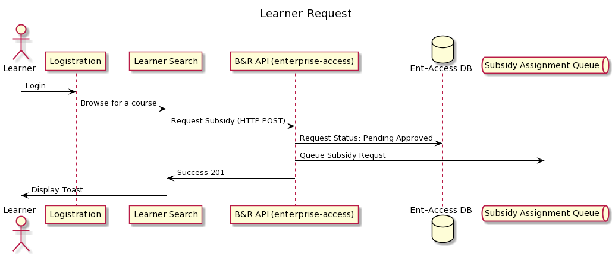

*****************************
Request and Approve Workflows
*****************************

One of the services provided by the enterprise-access IDA is to allow Learners to request a course and Admins to approve
these requests.

The diagrams below detail these interactions within the system.

Admin Approval
###############
PlantUML
::
    @startuml
    actor         "Admin"                             as   admin
    participant   "Logistration"                      as   logistration
    participant   "Admin Dashboard"                   as   adminDash
    participant   "B&R API (enterprise-access)"       as   enterpriseAccessAPI
    database      "Ent-Access DB"                     as   entAccessDB
    queue         "Subsidy Assignment Queue"          as   subAssignmentQueue
    participant   "Subsidy Assignment worker"         as   subsidyAssignmentWorker
    participant   "Ecommerce API/License Manager API" as   subsidyAPIS
    queue         "Notification Queue"                as   notificationQueue
    participant   "Notification worker"               as   notificationWorker
    participant   "Braze Email Campaign"              as   brazeCampaign

    title Admin Approval

    admin-[#000000]>logistration: Login
    logistration-[#000000]>adminDash: View pending requests
    adminDash-[#000000]>enterpriseAccessAPI: Approve Subsidy Request (HTTP POST)
    enterpriseAccessAPI-[#000000]>entAccessDB: Request Status: Pending
    enterpriseAccessAPI-[#000000]>subAssignmentQueue: Queue Subsidy Requst
    enterpriseAccessAPI-[#000000]>adminDash: Success 201
    adminDash-[#000000]>admin: Display Toast
    subsidyAssignmentWorker -[#F748A5]>subAssignmentQueue: Attempt to assign subsidy
    subsidyAssignmentWorker -[#F748A5]>subsidyAPIS: Assign subsidy
    subsidyAPIS-[#F748A5]>subsidyAssignmentWorker: Success or Failure
    subsidyAssignmentWorker-[#F748A5]>entAccessDB: Update request status (Approved/Pending)
    subsidyAPIS -[#F748A5]>notificationQueue: Queue Success/Failure Notification
    notificationWorker -[#359B73]>notificationQueue: Attempt to Notify Learner
    notificationWorker -[#359B73]>brazeCampaign: Notify via Braze
    brazeCampaign-[#359B73]>notificationWorker: Success or Failure
    @enduml

|approve_workflow|

Learner Request
###############
PlantUML
::
    @startuml
    actor         "Learner"                           as   learner
    participant   "Logistration"                      as   logistration
    participant   "Learner Search"                    as   learnerSearch
    participant   "B&R API (enterprise-access)"       as   enterpriseAccessAPI
    database      "Ent-Access DB"                     as   entAccessDB
    queue         "Subsidy Assignment Queue"          as   subAssignmentQueue

    title Learner Request

    learner-[#000000]>logistration: Login
    logistration-[#000000]>learnerSearch: Browse for a course
    learnerSearch-[#000000]>enterpriseAccessAPI: Request Subsidy (HTTP POST)
    enterpriseAccessAPI-[#000000]>entAccessDB: Request Status: Pending Approved
    enterpriseAccessAPI-[#000000]>subAssignmentQueue: Queue Subsidy Requst
    enterpriseAccessAPI-[#000000]>learnerSearch: Success 201
    learnerSearch-[#000000]>learner: Display Toast

|learner_request|

