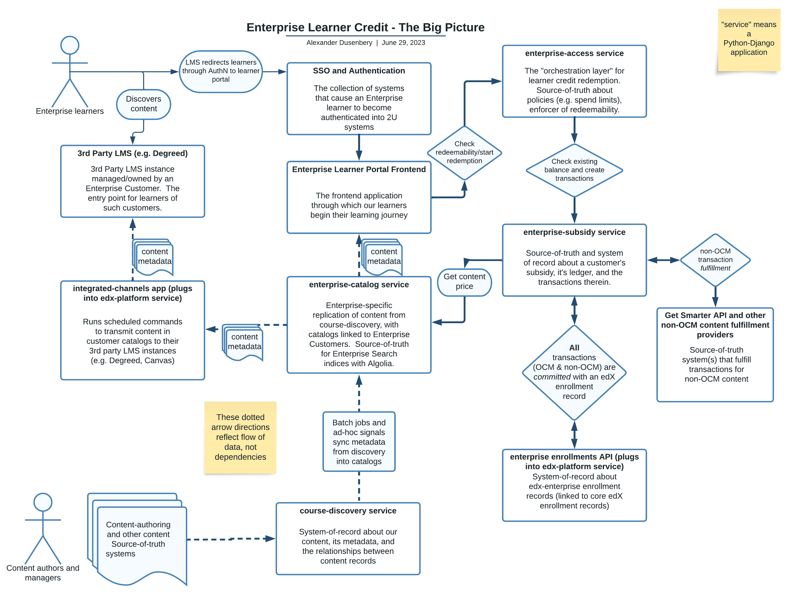

Subsidy Access Policy
#####################

.. contents:: :local:

Overview of Access Policies
***************************
The business decisions around which learners are allowed to redeem value for content can be varied and
sometimes complex, depending on the nature of our contract with an enterprise, for example:

- Enterprise Learners should only be able to spend 500 dollars on a particular type of content during the life of their subsidy.
- Enterprise Learners should only be able to enroll in courses that are in a catalog associated with an enterprise.
- Enterprise Learners should only be able to enroll in 3 courses, maximum, during the lifetime of their subsidy.

Previously, these rules were enforced across multiple frontend and backend code, making it very difficult
to ascertain how such rules are applied without examining multiple codebases. 
The ``subsidy_access_policy`` application (its models and APIs) allow us to
represent and enforce these rules in a centralized location.
A base access policy model is composed of references to an enterprise subsidy, an enterprise catalog,
an access method (e.g. direct learner enrollment, or Browse & Request), and optionally, the total value allowed
to be redeemed via the policy (that is, the maximum number of dollars or seats allowed to be consumed).

Keep in mind that multiple of these allowable business decisions,
which are encapsulated as ``SubsidyAccessPolicy`` records, may be applicable at a given time for a given enterprise.

See `<0004-add-access-policy-functionality.rst>`_ for design and implementation details of
the ``subsidy_access_policy`` app.

Relationship to Enterprise Subsidies
************************************
Subsidy Access Policies are inherently coupled to the notion of Enterprise ``Subsidy`` records.  Such records
live in the ``enterprise-subsidy`` service, which provides an implementation of Learner Credit,
through which learners in an enterprise can redeem the balance of their enterprise's Learner Credit ledger to pay
for verified enrollments in any kind of content supported via Enterprise Catalogs.

The subsidy access policy application allows us to command and query who is allowed to redeem
subsidy value, from which allowed set of content, via what access method.  It also supports our
general compliance requirements, protecting our business reputation and general business accounting veractiy.

Where Access Policies fit in the Big Picture
********************************************
Subsidy Access Policies are one component of a system that supports the discovery of a diverse set of
content, as well as the redemptoin and enrollment of learners into such content via an Enterprise customer's subsidy.
The Subsidy Access Policy API serves as a primary orchestration layer for *querying* whether a given
piece of content is redeemable for an enteprise learner, and for *commanding* the redemption, fulfillment, and
enrollment of that learner into a course run for the content.

|big_pic|

From the bottom left of this diagram, we can start by following the general path of data
about **content** through this system:

#. Content authors, using a variety of authoring tools and system, create content that is housed in various
   source-of-truth systems.
#. Various processes serialize and transmit metadata describing this content into the ``course-discovery`` service,
   which is our system-of-record about the metadata (and its relations to other metadata).
#. Batch and ad-hoc enterprise jobs synchronize this metadata from ``course-discovery`` into ``enterprise-catalog``,
   which holds our Enterprise-specific replication of content from ``course-discovery``, with catalogs
   linked to Enterprise Customers.
#. The ``integrated_channels`` app runs scheduled commands to transmit customer catalog
   content metadata from ``enterprise-catalog`` to the customers' 3rd party LMS instances (
   e.g. Degreed, Canvas, etc)
#. The 3rd party LMS instances, which are managed/owned by Enterprise customers, are the
   entry point into our system for the customers' learners.
#. Enterprise learners discovery content via their LMS instances.  The metadata about a given content record
   was, again, transmitted to the LMS instance via``integrated_channes``,
   which along with ``enterprise-catalog``, injects hyperlinks into the metadata that
   direct learners into our system.
#. These links are functionally gated by our SSO and Authentication mechanisms, through
   which learners must pass to become authenticated into the edX Enterprise system.
#. Once authenticated, learners land in the Enterprise Learner Portal frontend.  Notably, this frontend
   contains *Course About pages* from which the authenticated learners can begin their **redemption** flow.
#. This is where ``enterprise-access`` and the Subsidy Access Policy API come into play.  This API
   serves as the orchestration layer for learner credit redemption.  It's the source-of-truth
   about policies and enforcement thereof.  This API helps determine if a content record can
   be redeemed by an Enterprise learner, taking into consideration the learner's relationship to an enterprise,
   the inclusion of the content in a catalog of the customer, the policy redemption limits, and the
   current balance of the customer's subsidy/ledger.
#. The ``enterprise-subsidy`` service is the source-of-truth and system-of-record about all
   **Transactions** that represent the redemption of subsidy value by learners of an enterprise.
   These transactions tie directly to a *ledger*, which ties directly to a ``Subsidy`` record
   associated with the customer.
#. Any "non-OCM" content has transactions *fulfilled* via external content fulfillment providers.  As of June 2023,
   the GetSmarter API gateway is the only such provider.
#. **All** transactions (OCM or otherwise) are *committed* (the "happy-path success state" of a transaction)
   with a set of edX Enterprise enrollment records.  This occurs via the Enterprise Enrollments API,
   a plugin of the edx-platform service.

Fin.
